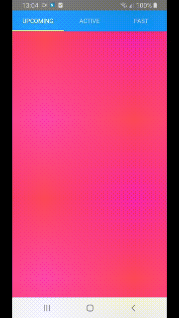

# [React Native Tab View Demo](https://www.npmjs.com/package/react-native-tab-view)
To use this library you need to ensure you are using the correct version of React Native. If you are using a version of React Native that is lower than 0.63 you will need to upgrade that before attempting to use this library.



react-native-tab-view Version	Required React Native Version
2.x.x	< 0.63
3.x.x	>= 0.63

### Installation
Open a Terminal in the project root and run:
```
yarn add react-native-tab-view
```
Now we need to install react-native-pager-view if you plan to support iOS and Android.
```
yarn add react-native-pager-view
```
We're done! Now you can build and run the app on your device/simulator.

### Quick Start

```
import * as React from 'react';
import { View, useWindowDimensions } from 'react-native';
import { TabView, SceneMap } from 'react-native-tab-view';

const FirstRoute = () => (
  <View style={{ flex: 1, backgroundColor: '#ff4081' }} />
);

const SecondRoute = () => (
  <View style={{ flex: 1, backgroundColor: '#673ab7' }} />
);

const renderScene = SceneMap({
  first: FirstRoute,
  second: SecondRoute,
});

export default function TabViewExample() {
  const layout = useWindowDimensions();

  const [index, setIndex] = React.useState(0);
  const [routes] = React.useState([
    { key: 'first', title: 'First' },
    { key: 'second', title: 'Second' },
  ]);

  return (
    <TabView
      navigationState={{ index, routes }}
      renderScene={renderScene}
      onIndexChange={setIndex}
      initialLayout={{ width: layout.width }}
    />
  );
}
```